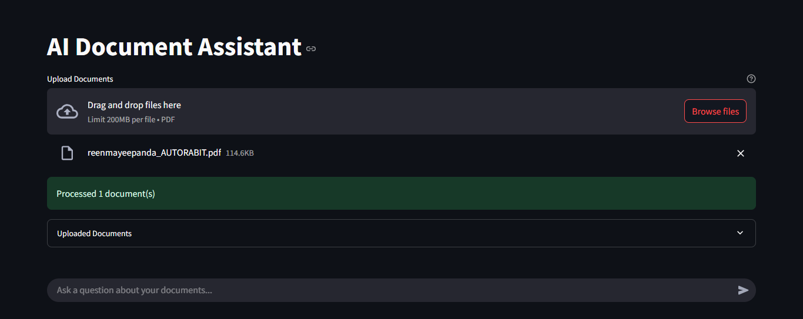
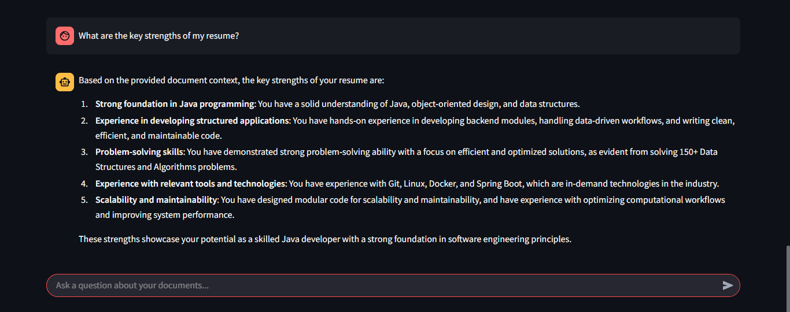
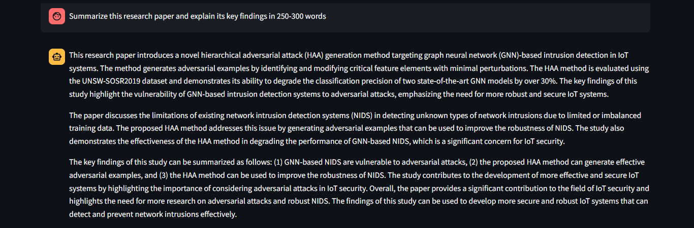

# AI Document Assistant (RAG)

A Retrieval-Augmented Generation (RAG) application that enables users to upload PDF documents and interact with them through natural language. The system combines semantic search, vector databases, and Large Language Models (LLMs) to deliver accurate, context-aware responses grounded in document content.

---

## Demo

### Upload PDF



### Resume Analysis



### Research Paper Analysis



---

## Key Features
- Upload and analyze PDF documents
- Semantic document search using vector embeddings
- Context-aware question answering
- Conversational memory across interactions
- Resume analysis and improvement suggestions
- Research paper summarization and explanation
- Multi-document support
- Fast retrieval with FAISS vector indexing
- LLM-powered responses using Groq (Llama 3.3 70B)

---

## Architecture

```text
PDF Upload
     │
     ▼
Text Extraction
     │
     ▼
Chunking
     │
     ▼
Sentence Embeddings
     │
     ▼
FAISS Vector Store
     │
     ▼
Semantic Retrieval
     │
     ▼
Relevant Context
     │
     ▼
LLM (Groq)
     │
     ▼
Final Response
```

---

## Tech Stack

### Frontend
- Streamlit

### Backend
- Python

### Retrieval
- FAISS

### Embeddings
- Sentence Transformers
- all-MiniLM-L6-v2

### LLM
- Groq API
- Llama 3.3 70B Versatile

### PDF Processing
- PyPDF

---

## Project Structure

```text
rag_ai_chatbot/
│
├── llm/
│   └── generator.py
│
├── processing/
│   ├── chunking.py
│   ├── embedding.py
│   └── pdf_loader.py
│
├── retrieval/
│   ├── retriever.py
│   └── vector_store.py
│
├── main.py
├── streamlit_app.py
├── requirements.txt
└── README.md
```

---

## How It Works

1. User uploads a PDF document.
2. Text is extracted and split into chunks.
3. Each chunk is converted into embeddings.
4. Embeddings are stored in a FAISS vector database.
5. User asks a question.
6. Relevant document chunks are retrieved.
7. Retrieved context + conversation history are sent to the LLM.
8. The model generates a grounded response.

---

## Example Queries

### Resume Analysis

- Analyze my resume
- What are my strengths?
- What projects have I worked on?
- What improvements should I make?

### Research Paper Analysis

- Summarize this paper
- Explain the methodology
- What dataset was used?
- What are the key findings?

### General Document QA

- Give me a summary
- Explain section 3
- What are the important points?
- What conclusions were drawn?

---

## Skills Demonstrated

- Retrieval-Augmented Generation (RAG)
- Semantic Search
- Vector Databases
- Embedding Models
- Information Retrieval
- Prompt Engineering
- LLM Integration
- Full-Stack AI Application Development

---

## ▶ Run Locally

```bash
git clone <repository-url>

cd rag_ai_chatbot

pip install -r requirements.txt

streamlit run streamlit_app.py
```

---

## Impact

Built an end-to-end AI-powered document assistant capable of understanding and answering questions from resumes, research papers, and technical documents through semantic retrieval and context-aware generation.

---

## Author

**Reenmayee Panda**

B.Tech, Computer Engineering  
IIIT Bhubaneswar

Interested in Artificial Intelligence, Machine Learning, NLP, FinTech, and Software Engineering.

---

⭐ If you found this project interesting, consider starring the repository.